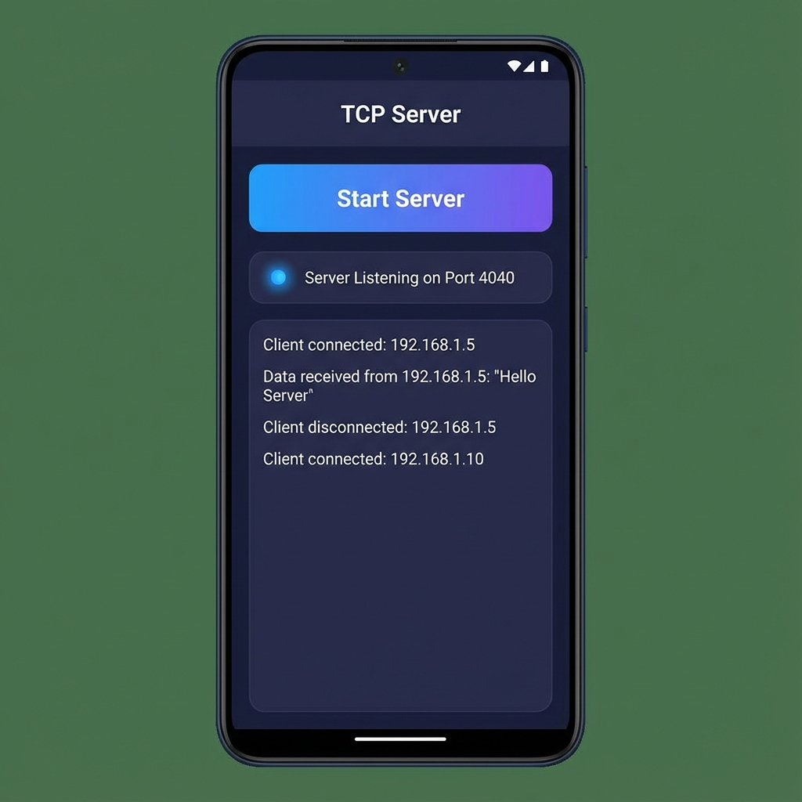
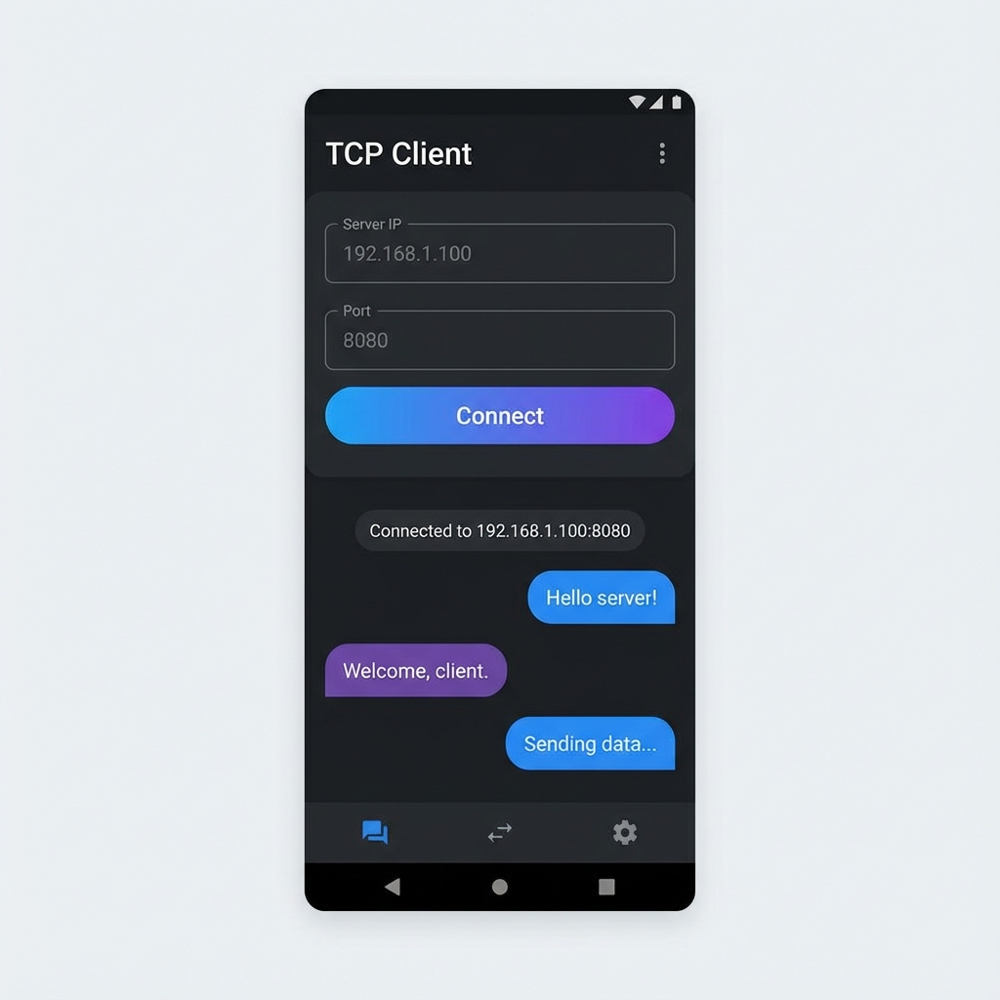

# TCP 聊天应用 (TCP Chat App)

[中文文档](README_zh-CN.md) | [English](README.md)

这是一个使用 Flutter 构建的功能丰富且强大的 TCP 聊天应用程序。该应用通过允许用户在局域网内使用 TCP 套接字进行通信，展示了核心网络编程概念。它具备客户端和服务器双模式、设备发现以及消息历史记录功能。


## 功能特性

*   **双模式**：可作为 **TCP 服务器** 或 **TCP 客户端** 运行。
*   **设备发现**：自动发现局域网内运行该应用的其他设备。
*   **实时聊天**：即时发送和接收文本消息。
*   **消息历史**：使用 SQLite 本地持久化保存聊天记录。
*   **连接管理**：查看活动连接并管理会话状态。
*   **跨平台**：支持 Android、iOS 和桌面端 (macOS/Windows/Linux)。

## 快速开始

### 前置要求

*   [Flutter SDK](https://flutter.cn/docs/get-started/install) (推荐 3.0.0 或更高版本)
*   用于运行应用的真机或模拟器。

### 安装步骤

1.  **克隆仓库：**
    ```bash
    git clone https://github.com/yourusername/tcp_chat_app.git
    cd tcp_chat_app
    ```

2.  **安装依赖：**
    ```bash
    flutter pub get
    ```

3.  **运行应用：**
    ```bash
    flutter run
    ```

## 使用指南

### 服务器模式 (Server Mode)
1.  切换到 **Server (服务器)** 标签页。
2.  点击 **Start Server (启动服务器)**。应用将在指定端口（默认：`4040`）上监听。
3.  将你的 IP 地址分享给客户端，或者让他们通过发现功能找到你。
4.  接受传入的连接并开始聊天！



### 客户端模式 (Client Mode)
1.  切换到 **Client (客户端)** 标签页。
2.  输入 **Server IP (服务器 IP)** 和 **Port (端口)**，或者使用 **Discover (发现)** 功能查找可用服务器。
3.  点击 **Connect (连接)**。
4.  连接成功后，即可向服务器发送消息。



### 设备发现 (Device Discovery)
1.  进入 **Discovery (发现)** 页面。
2.  应用将扫描局域网内的其他设备。
3.  点击已发现的设备可自动填入连接信息。

## 技术栈

*   **框架**：[Flutter](https://flutter.cn/)
*   **语言**：[Dart](https://dart.cn/)
*   **网络**：`dart:io` (Socket, ServerSocket)
*   **本地数据库**：`sqflite`
*   **状态管理**：`Provider` / `setState` (为保持简单使用基础状态管理)

## 许可证

本项目采用 MIT 许可证 - 详情请参阅 [LICENSE](LICENSE) 文件。
